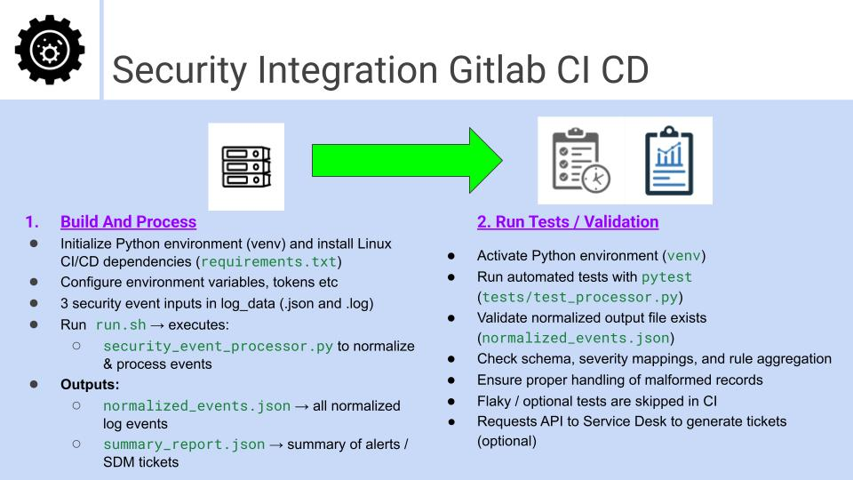
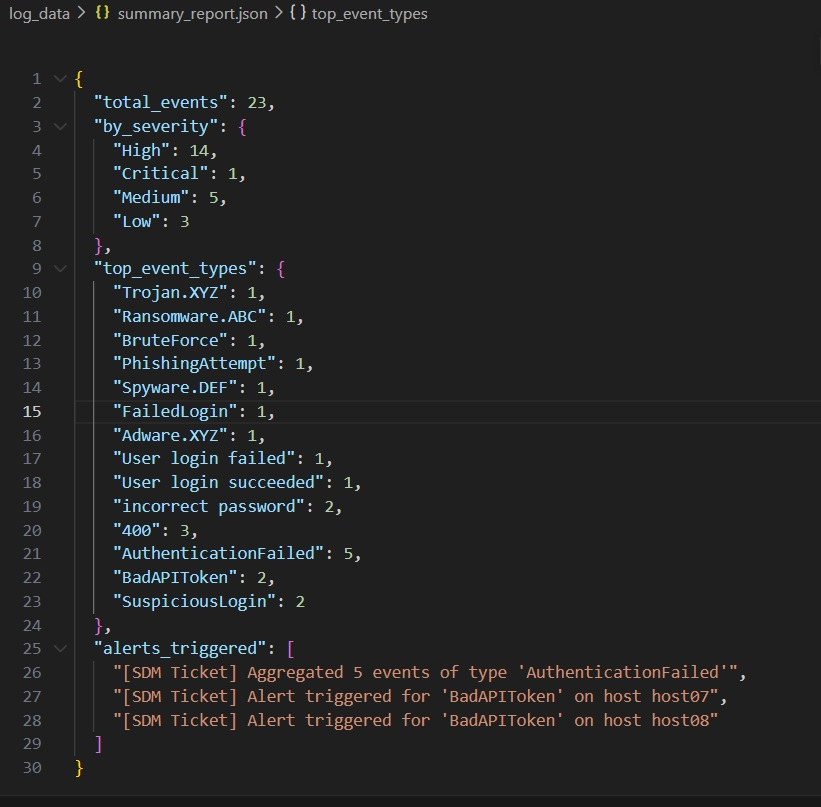

# SecurityIntegration

## Overview
This project demonstrates a simple pipeline for ingesting, normalizing, and correlating security event data from multiple sources (JSON and logs) into a consistent format for downstream systems.

---

## Features
- Multi-source ingestion (AV, Splunk-style JSON, log files)
- Normalization into a common schema
- Timezone handling (converted to UTC)
- Severity mapping
- Rule-based aggregation and alerting
- Mock ServiceDesk ticket generation
- Automated tests with pytest

---

## Architecture Overview



This pipeline processes security events from multiple sources:

1. Input Sources:
   - Antivirus JSON
   - Splunk-style nested JSON
   - Semi-structured log file

2. Processing:
   - Ingestion → parsing raw formats
   - Normalization → common schema
   - Enrichment → severity mapping
   - Rule Engine → aggregation & alerting

3. Output:
   - `normalized_events.json` (All normalized log events)
   - `summary_report.json` (Aggregated incidents/tickets and summary)
   - Simulated ServiceDesk tickets (API requests for automated tickets)

---

## Assumptions
- Timestamps may be ISO strings or epoch integers.
- Severity mapping: INFO → Low, WARN → Medium, ERROR → High, Critical → Critical.
- Aggregation thresholds are defined per event type in the rules dictionary.
- Duplicate handling is per ingestion session.

---

## AI Usage Note
The initial folder structure was suggested by UI. I refined it with the YML, shell script etc.
The log_data was generated similar to security log data sources in .json format.
Formatting, code reviews and code snippets were assisted by AI (ChatGPT) and GitLab Duo coding suggestions also. 
I verified, corrected, and tested all outputs and logs.
Often AI had a solid start, but needed more creative and real world input like differing time stamps and data formats beyond .json.
I used my creativity with AI quality to reach a happy medium of quality and speed for this effort.

---

## ServiceNow Modeling (Mock)
Normalized events map to a Security Events table:

| Field         | Description                          |
|---------------|--------------------------------------|
| timestamp     | Event time in UTC                     |
| host          | Source host or system                 |
| event_type    | Type of security event                |
| severity      | Normalized severity                   |
| user          | Associated user or account            |

Rules trigger Incident or Alert records via API (simulated).

---

## Event Flow
Raw Events → Ingestion → Normalization → Rule Engine → Output (JSON + Tickets)

---

## Normalized Event Example
```json
{
  "id": "host01_1679464800",
  "timestamp": "2026-03-22T15:00:00+00:00",
  "host_or_source": "host01",
  "event_type": "AuthenticationFailed",
  "severity": "High",
  "user": "jdoe",
  "raw_source": "security_app"
}
```
## Python Run Commands

### Linux/macOS
```bash
python3 -m venv venv
source venv/bin/activate
pip install -r requirements.txt
python src/security_processor.py
pytest
```

### Windows
```powershell
python -m venv venv
.\venv\Scripts\activate
pip install -r requirements.txt
python src/security_processor.py
pytest
```


